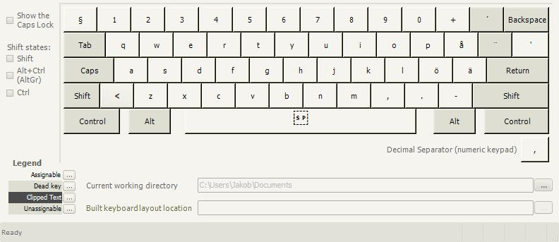
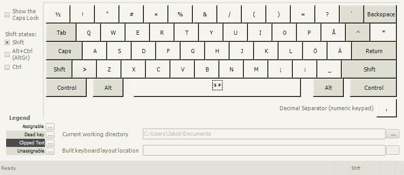
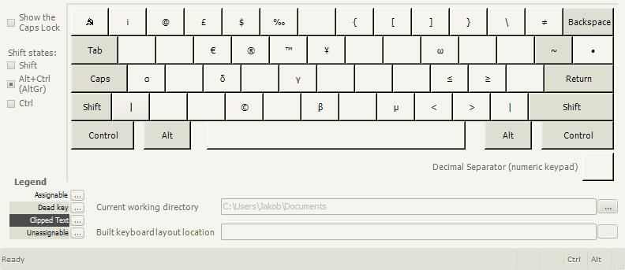
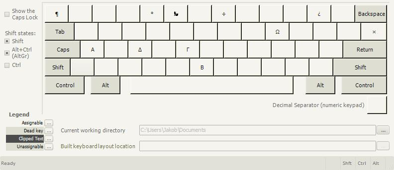

# swansi
Swedish keyboard layout on ANSI keyboard - with improvements!

# Installation
Download the release and run setup.exe (not one of the .msi packages)

# Uninstallation
Re-run setup.exe and it will give you the option to either uninstall or repair.

# Contributing
Edit `swansi.klc` with [Microsoft Keyboard Layout Creator](https://msdn.microsoft.com/en-us/globalization/keyboardlayouts.aspx)

# Layout
**Base layer:**

**Shift layer:**

**AltGr (Ctrl + Alt) layer:**

**Shift AltGr (Shift + Ctrl + Alt) layer:**

